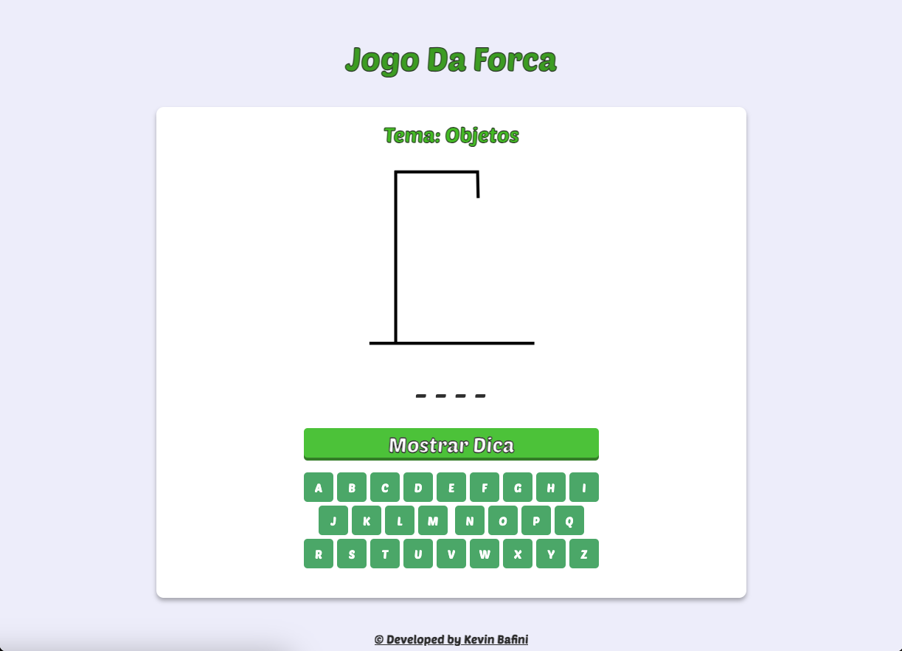
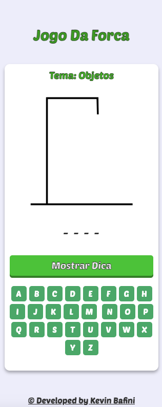

<h1 align="center">Jogo Da Forca</h1>

<p align="center">Esse projeto foi desenvolvido especialmente para o aprendizado e especificação das tecnologias abaixo, e para mostrar o game interativo.</p>

## Recursos:

- Seleção de palavras divididas em categorias (Frutas, Animais, Objetos, Veículos, Países)
- Exibição de dicas para ajudar o jogador
- Sons de acerto e erro
- Efeitos de confetes ao acertar a palavra
- Interface responsiva para diversos tamanhos de tela

## 🛠 Tecnologias

As seguintes ferramentas foram usadas na construção do projeto:

- HTML5
- CSS3 
- JavaScript

## 🎮 Como Jogar

- Clique no botão "Iniciar Jogo" para começar.
- O tema e a dica da palavra serão exibidos.
- Clique nas letras para adivinhar a palavra.
- Se errar, a imagem do jogo da forca será atualizada.
- Se acertar, efeitos de confetes serão exibidos e um som de acerto será reproduzido.
- Após acertar ou errar, uma nova rodada começará automaticamente.

<h2 align="center">✅ Demonstração da aplicação</h2>

<h3 align="center"> Demonstração aplicada no Smartphone (Tela de inicio)</h3>

<br>

<div align="center">

</div>

<br>

<h3 align="center"> Demonstração aplicada no Computador</h3>

<div align="center">

</div>

<br>

<h3 align="center"> Demonstração aplicada no Smartphone</h3>

<div align="center">

</div>

## Instalação

Para executar este projeto localmente, siga estes passos:

- Clone o repositório para sua máquina local:

```bash
https://github.com/Kevinbafini/primary_shop.git
```

Isso criará uma cópia local do repositório em sua máquina.

Se você não tem o Git instalado, você pode baixar o projeto diretamente como um arquivo ZIP através do GitHub e descompactá-lo no diretório de sua escolha.

- Navegue até o diretório do projeto:

Após clonar ou descompactar o repositório, use o terminal ou o explorador de arquivos para navegar até o diretório do projeto.

## Suporte a Navegadores
Este projeto é melhor visualizado nos seguintes navegadores:

- Google Chrome (Versão mais recente)
- Mozilla Firefox (Versão mais recente)
- Safari (Versão mais recente)
- Microsoft Edge (Versão mais recente)
<br>
Certifique-se de estar usando a versão mais atualizada do navegador para a melhor experiência.

## Autor

<h3 font-weight: 900;>Feito por Kevin Bafini</h3>


[](https://www.linkedin.com/in/kevinbafini/)
[](https://www.instagram.com/kevin_bafini12/)
[](https://github.com/Kevinbafini)


## Entre em contato!

<h3 font-weight: 900;>Kevin Bafini</h3>


[](https://wa.me/5517991606869)
[](https://www.instagram.com/kevin_bafini12/)

